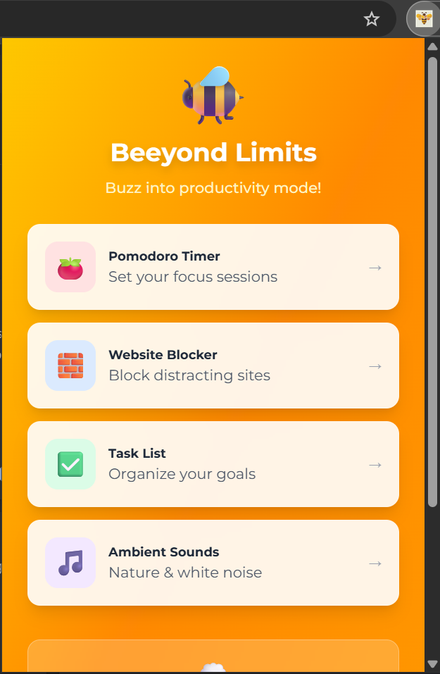
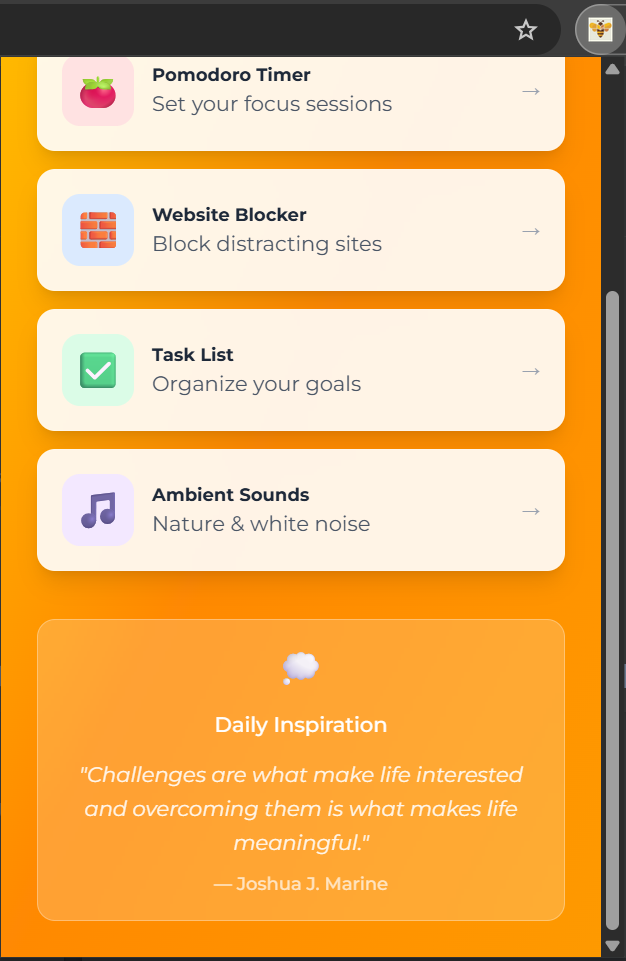
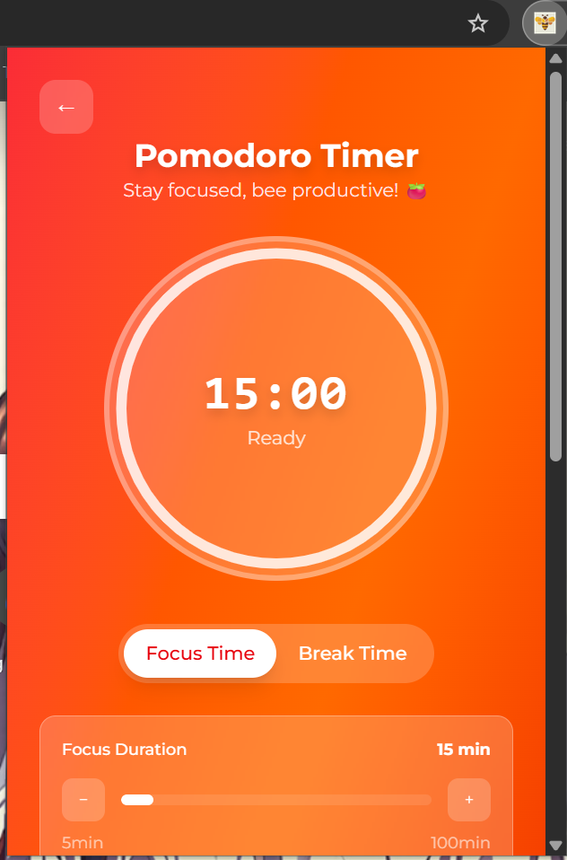
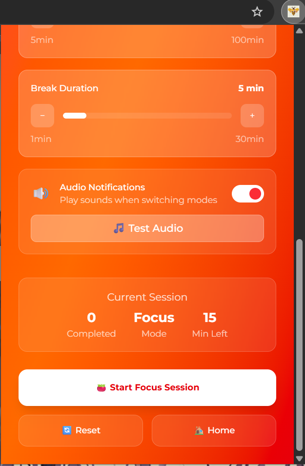
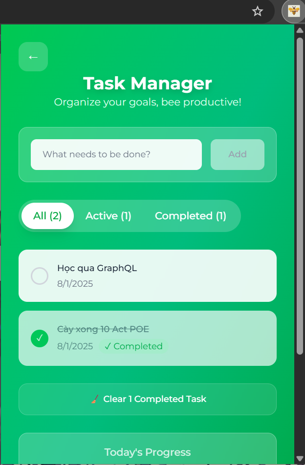
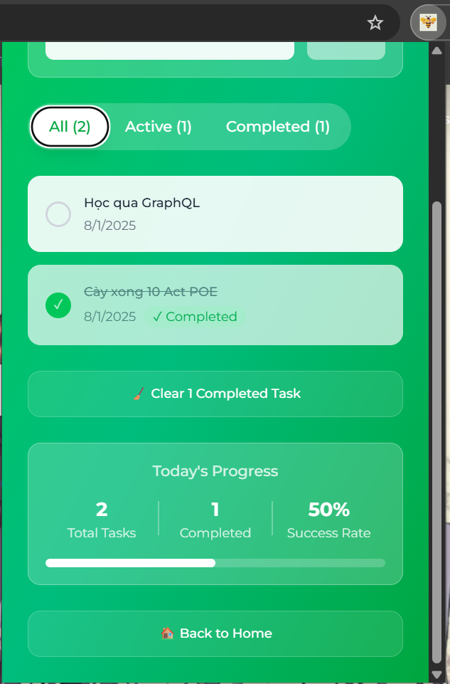
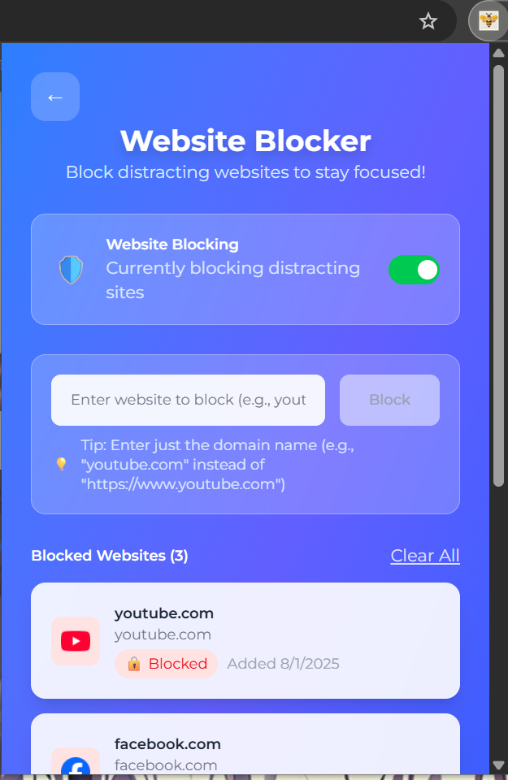
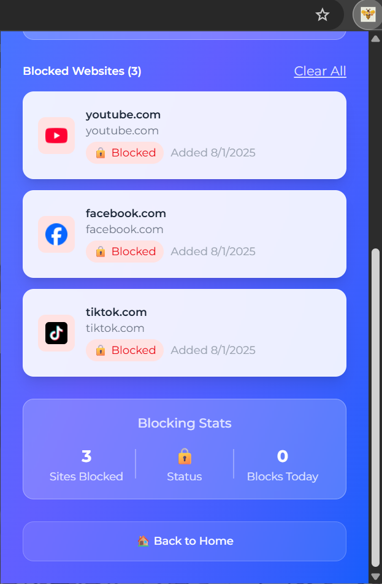
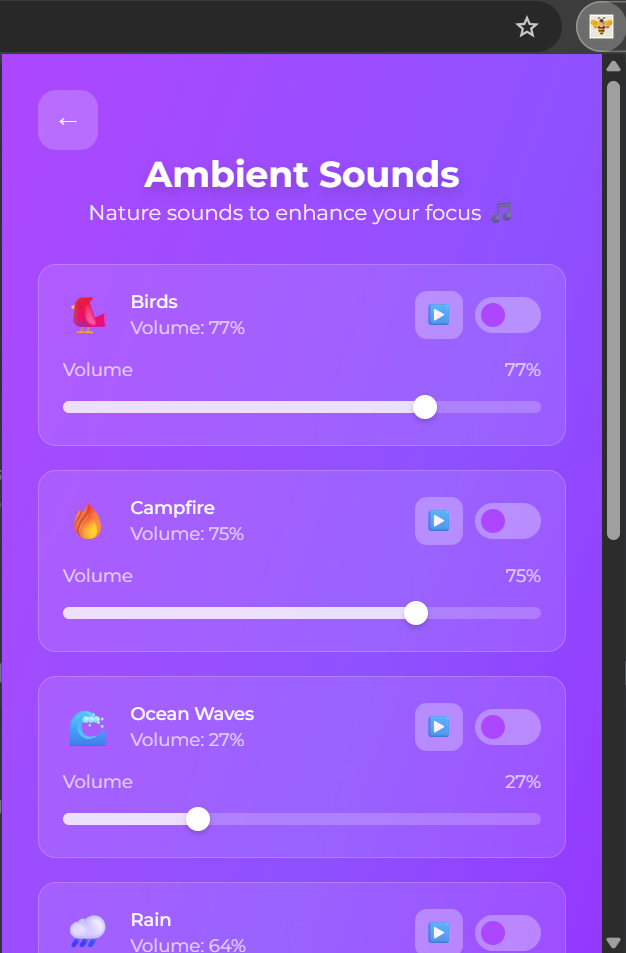
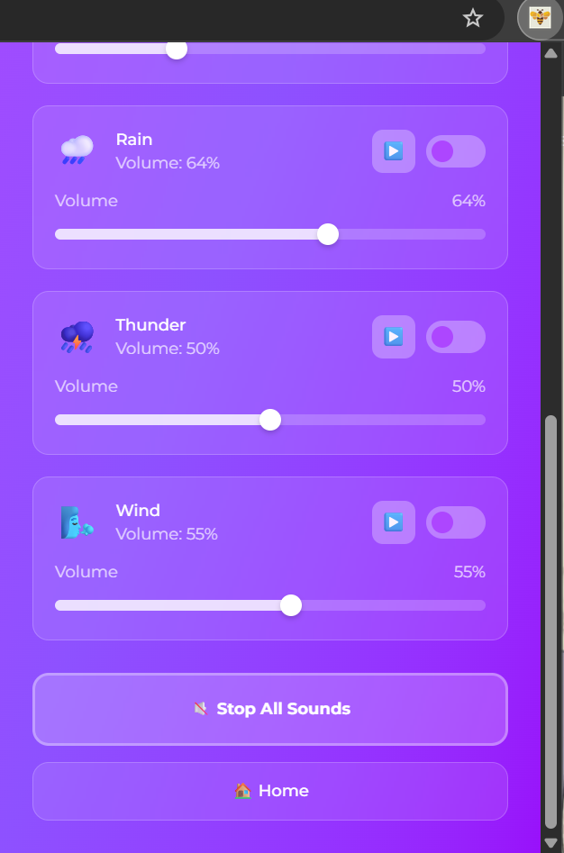

# 🐝 Beeyond Limits - Chrome Extension

**Tăng cường năng suất với công cụ quản lý thời gian và tập trung toàn diện**

Beeyond Limits là một Chrome Extension được thiết kế để giúp bạn vượt qua sự phân tâm và đẩy khả năng tập trung lên tầm cao mới. Lấy cảm hứng từ loài ong(Bee) cần cù, đã đến lúc bay vượt qua sự trì hoãn và đạt được tiềm năng thực sự của bạn.


---

## **Tính Năng Chính**

- 🍅 **Pomodoro Timer** - Quản lý thời gian tập trung với chu kỳ làm việc/nghỉ ngơi tùy chỉnh
- 🚫 **Chặn Website** - Chặn các trang web gây phân tâm trong thời gian tập trung
- 📝 **Quản Lý Công Việc** - Tạo, sắp xếp và theo dõi danh sách việc cần làm
- 🎵 **Âm Thanh Tự Nhiên** - Âm thanh thiên nhiên giúp tăng cường tập trung (Mưa, Sóng biển, Chim hót, v.v.)
- 💭 **Quotes Hàng Ngày** - Những câu nói truyền cảm hứng mỗi ngày
- 🔔 **Thông Báo Thông Minh** - Cảnh báo desktop khi chuyển đổi giữa các phiên làm việc
- 📊 **Theo Dõi Tiến Độ** - Giám sát quá trình nâng cao năng suất của bạn

---

## **Công Nghệ Sử Dụng**

### **Frontend Framework**

- **React 19.1.0** - Thư viện JavaScript để xây dựng giao diện người dùng
- **Vite 5.4.19** - Build tool nhanh và hiện đại
- **Tailwind CSS 4.1.11** - Framework CSS utility-first cho styling

### **Chrome Extension APIs**

- **Manifest V3** - Phiên bản manifest mới nhất cho Chrome Extension
- **Service Worker** - Background script để xử lý logic chạy ngầm
- **Chrome Storage API** - Lưu trữ dữ liệu người dùng
- **Chrome Tabs API** - Quản lý và tương tác với các tab
- **Chrome Notifications API** - Hiển thị thông báo hệ thống
- **Offscreen Documents** - Phát âm thanh ambient trong background

---

## 🚀 **Hướng Dẫn Cài Đặt**

### **📋 Yêu Cầu Hệ Thống**

Trước khi bắt đầu, hãy đảm bảo bạn có:

- **Node.js** (phiên bản 16 trở lên) - [Tải tại đây](https://nodejs.org/)
- **npm** (đi kèm với Node.js)
- **Google Chrome** browser
- **Git** (tùy chọn, để clone repository)

---

### **📥 Bước 1: Tải Mã Nguồn**

#### **Clone với Git**

```bash
git clone https://github.com/NguyenHungCuongg/Beeyond-Limits.git
cd Beeyond-Limits
```

---

### **⚙️ Bước 2: Cài Đặt Dependencies**

```bash
npm install
```

---

### **🔨 Bước 3: Build Extension**

```bash
npm run build
```

✅ **Kiểm tra**: Bạn sẽ thấy thư mục `dist` trong project với khoảng 20 files.

---

### **🔧 Bước 4: Cài Đặt Vào Chrome**

#### **Bật Developer Mode:**

1. Mở Google Chrome
2. Truy cập `chrome://extensions/`
3. Bật **"Developer mode"** (góc trên bên phải)

#### **Load Extension:**

1. Nhấp **"Load unpacked"**
2. Điều hướng đến thư mục project của bạn
3. Chọn thư mục **`dist`** (⚠️ Quan trọng: Chọn thư mục `dist`, không phải thư mục project chính)
4. Nhấp **"Select Folder"**

#### **Xác Nhận Cài Đặt:**

- Extension sẽ xuất hiện trong danh sách extensions
- Bạn sẽ thấy icon **Beeyond Limits** trên thanh công cụ Chrome
- Trạng thái extension hiển thị **"Enabled"**

---

### **🎉 Bước 5: Bắt Đầu Sử Dụng**

## 📱 **Giao Diện**

### **🏠 Trang Chủ**

<div align="center">
  
  
</div>

### **🍅 Pomodoro Timer**

<div align="center">
  
  
</div>

### **📝 Quản Lý Công Việc**

<div align="center">
  
  
</div>

### **🚫 Chặn Website**

<div align="center">
  
  
</div>

### **🎵 Âm Thanh Tự Nhiên**

<div align="center">
  
  
</div>

---

## 📞 **Liên Hệ**

Nếu bạn có câu hỏi hoặc cần hỗ trợ, liên hệ:

- **Email**: cuonghungnguyentop@gmail.com
- **GitHub Issues**: [GitHub Issues](https://github.com/NguyenHungCuongg/Beeyond-Limits/issues)
- **Facebook** : [https://www.facebook.com/cuong.nguyen.813584/](https://www.facebook.com/cuong.nguyen.813584/)
- **Linkedin** : [https://www.linkedin.com/in/c%C6%B0%E1%BB%9Dng-nguy%E1%BB%85n-76153a333/](https://www.linkedin.com/in/c%C6%B0%E1%BB%9Dng-nguy%E1%BB%85n-76153a333/)
