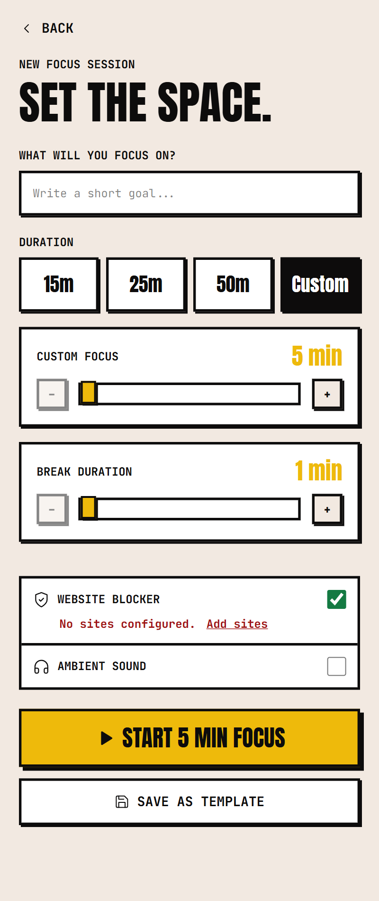
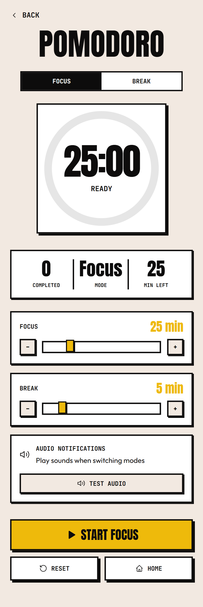
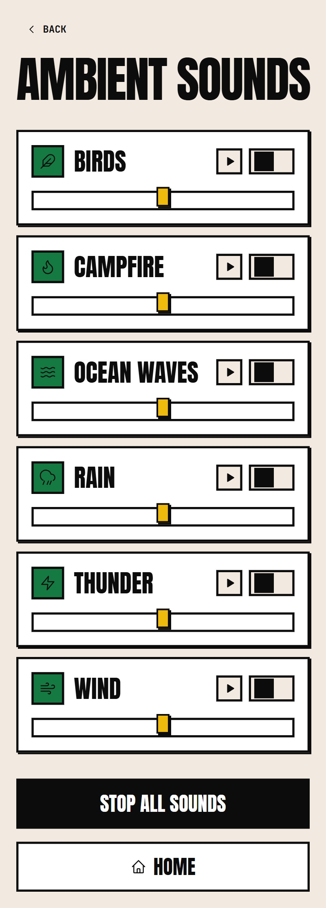
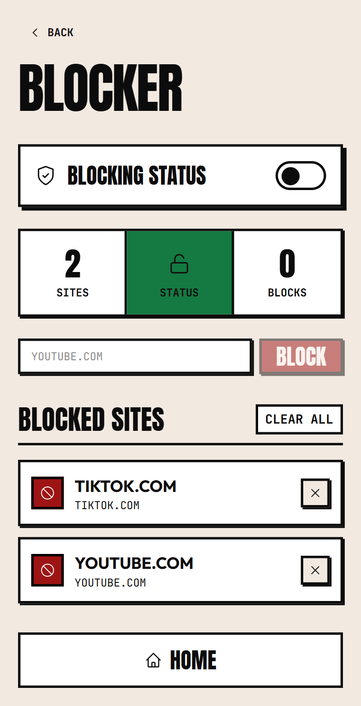
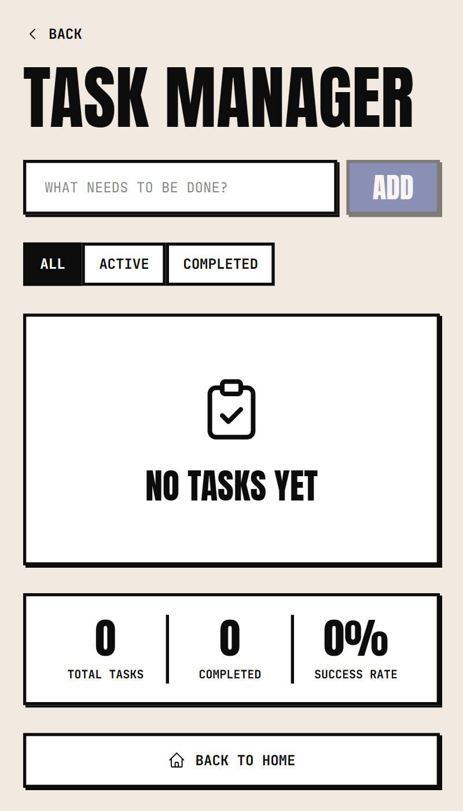

# 🐝 Beeyond Limits

<pre align="center" style="background: transparent; border: none; padding: 0;">
 ███████████                                                       █████
▒▒███▒▒▒▒▒███                                                     ▒▒███ 
 ▒███    ▒███  ██████   ██████  █████ ████  ██████  ████████    ███████ 
 ▒██████████  ███▒▒███ ███▒▒███▒▒███ ▒███  ███▒▒███▒▒███▒▒███  ███▒▒███ 
 ▒███▒▒▒▒▒███▒███████ ▒███████  ▒███ ▒███ ▒███ ▒███ ▒███ ▒███ ▒███ ▒███ 
 ▒███    ▒███▒███▒▒▒  ▒███▒▒▒   ▒███ ▒███ ▒███ ▒███ ▒███ ▒███ ▒███ ▒███ 
 ███████████ ▒▒██████ ▒▒██████  ▒▒███████ ▒▒██████  ████ █████▒▒████████
▒▒▒▒▒▒▒▒▒▒▒   ▒▒▒▒▒▒   ▒▒▒▒▒▒    ▒▒▒▒▒███  ▒▒▒▒▒▒  ▒▒▒▒ ▒▒▒▒▒  ▒▒▒▒▒▒▒▒ 
                                 ███ ▒███                               
                                ▒▒██████                                
                                 ▒▒▒▒▒▒                                 
 █████        ███                   ███   █████           
▒▒███        ▒▒▒                   ▒▒▒   ▒▒███            
 ▒███        ████  █████████████   ████  ███████    █████ 
 ▒███       ▒▒███ ▒▒███▒▒███▒▒███ ▒▒███ ▒▒▒███▒    ███▒▒  
 ▒███        ▒███  ▒███ ▒███ ▒███  ▒███   ▒███    ▒▒█████ 
 ▒███      █ ▒███  ▒███ ▒███ ▒███  ▒███   ▒███ ███ ▒▒▒▒███
 ███████████ █████ █████▒███ █████ █████  ▒▒█████  ██████ 
▒▒▒▒▒▒▒▒▒▒▒ ▒▒▒▒▒ ▒▒▒▒▒ ▒▒▒ ▒▒▒▒▒ ▒▒▒▒▒    ▒▒▒▒▒  ▒▒▒▒▒▒  
                                                          
                                                          
                                                                                                                                                      
</pre>
<div align="center">
  <p><strong>Find your flow, own your time.</strong></p>
  <p>A Chrome extension that turns a timer, task list, website blocker, and ambient sound mixer into one focused workflow.</p>
  <p>
    <a href="#-why-beeyond-limits">Why Beeyond Limits</a> ·
    <a href="#-features">Features</a> ·
    <a href="#-quick-start">Quick start</a> ·
    <a href="#-architecture">Architecture</a> ·
    <a href="#-contributing">Contributing</a>
  </p>
  <p>
    
    
    
    
    
  </p>
</div>

<!-- Replace this placeholder with your hero image or product mockup. -->
<!-- <p align="center">
  
</p> -->

## ✨ Why Beeyond Limits

Most productivity tools expose useful features as disconnected utilities. Beeyond Limits makes the **Focus Session** the main unit of progress: configure the conditions you need, start one session, and let the extension keep the workflow together.

It is designed for students, office workers, and freelancers who want a lightweight personal study/work companion without creating an account or depending on a server.

### Product principles

- **Session-first:** a timer, tasks, sound mix, and distraction rules belong to the same intention.
- **Local-first:** session templates, active state, preferences, and history are persisted in Chrome storage.
- **Low friction:** reopen the extension and return directly to an active session or its alarm screen.
- **One clear measure:** the product is oriented around completed focus sessions, not endless configuration.

## 🚀 Features

### Focus Session

- Configure focus and break durations.
- Attach tasks to the session and mark progress while working.
- Build a multi-track ambient mix with independent volume controls and preview buttons.
- Configure website blocking per session, independently from the standalone blocker tool.
- Run the Work → Break → Work loop continuously until you stop the session.
- Resume the active timer when reopening the extension popup.
- Complete, skip, or abandon a session with an explicit end state.

### Quick tools

- **Pomodoro:** a standalone timer with configurable work/break cycles and testable audio alarms.
- **Todo List:** a lightweight task list for planning and tracking work.
- **Website Blocker:** a separate quick tool for general browsing protection.
- **Ambient Sounds:** an independent sound mixer for use outside a Focus Session.

Quick tools remain useful on their own. While a Focus Session is running, the Pomodoro quick tool is locked to prevent two competing timers; Todo List and ambient sound controls remain available where appropriate.

### Alarm and extension UX

- Phase-completion alarms loop until muted.
- Test Audio plays once and never loops.
- A dedicated alarm popup appears when a Focus Session reaches a phase boundary, allowing the user to mute immediately and then continue to the completion screen.

## 🧭 How a Focus Session works

```text
Create session
     ↓
Configure timer · tasks · ambient mix · blocked sites
     ↓
Start focus <──────────────┐
     ↓                     │
Work complete → Break      │
     ↓                     │
Break complete → next Work ┘
     ↓
Stop / complete → session history
```

Each work cycle is tracked independently, so a long session can show meaningful progress even when it contains several work/break transitions.

## 🖼️ Screenshots

| Home                                          | Focus Session                               |
| --------------------------------------------- | ------------------------------------------- |
|                |  |
|        |  |
|  |        |

## ⚡ Quick start

### Requirements

- Google Chrome 127 or newer (required for the alarm popup flow).
- Node.js and npm.

### Install and load the extension

```bash
git clone https://github.com/NguyenHungCuongg/Beeyond-Limits.git
cd Beeyond Limits
npm install
npm run build
```

Then open `chrome://extensions` in Chrome:

1. Enable **Developer mode**.
2. Click **Load unpacked**.
3. Select the generated `dist/` directory.
4. Pin Beeyond Limits to the toolbar for quick access.

After source changes, run `npm run build` again and click **Reload** on the extension card.

## 🛠️ Development commands

| Command              | Purpose                                               |
| -------------------- | ----------------------------------------------------- |
| `npm run dev`        | Start the Vite development server.                    |
| `npm run build`      | Build the extension and copy MV3 assets into `dist/`. |
| `npm run copy-files` | Copy extension-only files after a build.              |
| `npm test`           | Run the Node test suite.                              |
| `npm run lint`       | Check the codebase with ESLint.                       |
| `npm run preview`    | Preview the production build locally.                 |

For extension integration work, use the production build and load `dist/` in Chrome. This exercises the service worker, alarms, storage, declarative network rules, offscreen audio, and popup lifecycle together.

## 🧱 Architecture

Beeyond Limits is a React 19 + Vite frontend packaged as a Chrome Manifest V3 extension.

```text
src/
├── background.js          # MV3 service worker and authoritative timers
├── core/
│   ├── focusSession.js     # Pure Focus Session state machine
│   ├── focusStorage.js     # chrome.storage persistence
│   ├── focusConnectors.js  # Timer, task, sound, and blocker integration
│   └── audio.js             # Offscreen audio protocol and playback
├── components/             # Reusable UI and session controls
├── pages/                  # Home, quick tools, active session, completion, alarm
└── hooks/                  # React state and extension messaging hooks
tests/                      # Domain, background, audio, and regression tests
manifest.json               # Chrome MV3 extension manifest
```

The service worker owns the authoritative Focus Session state and schedules phase transitions with `chrome.alarms`, so the timer continues when the popup is closed. UI pages communicate with it through a small message protocol and recover state from `chrome.storage.local`.

### Persistence

The current implementation uses these local storage records:

- `activeFocusSession` — the currently running or paused session.
- `focusSessionTemplates` — saved session configurations.
- `focusSessionHistory` — completed and abandoned sessions.
- `focusSessionPreferences` — user-level session preferences.

No backend is required to run the extension locally.

## 🧪 Quality checks

Before opening a pull request, run:

```bash
npm test
npm run lint
npm run build
```

When changing background behavior, also manually verify the extension from a loaded `dist/` build: close and reopen the popup, let a phase transition occur, mute the alarm popup, and confirm the next Work/Break cycle resumes with the saved configuration.

## 🤝 Contributing

Contributions are welcome. A practical workflow is:

1. Fork the repository and create a focused branch.
2. Make the smallest change that solves the problem.
3. Add or update regression tests for behavior changes.
4. Run the test, lint, and build commands above.
5. Open a pull request describing the user problem, the approach, and how it was verified.

Please preserve the existing neo-brutalist visual language, keep Focus Session state transitions deterministic, and avoid coupling the session blocker to the standalone Website Blocker quick tool.
